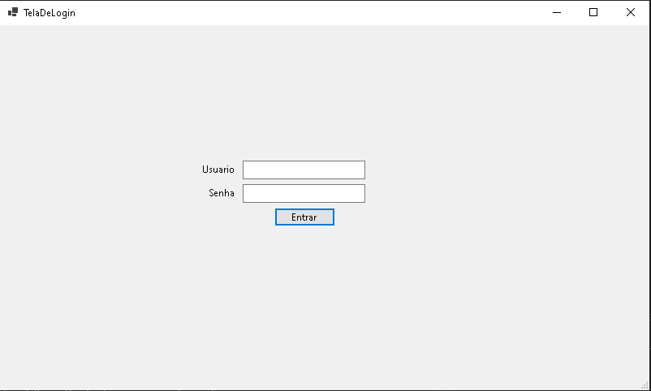
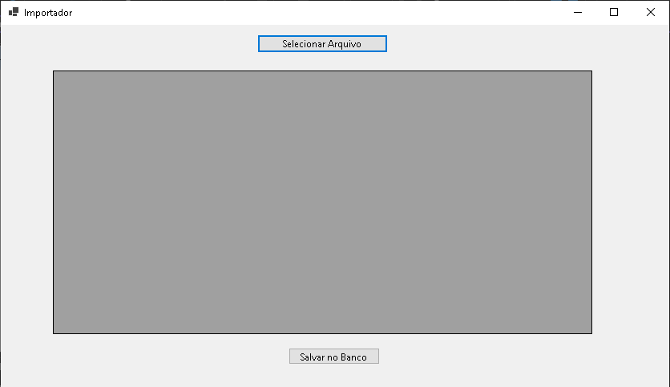
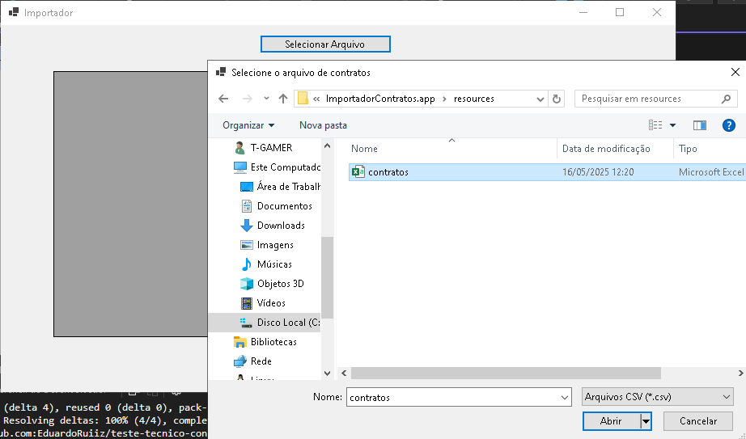
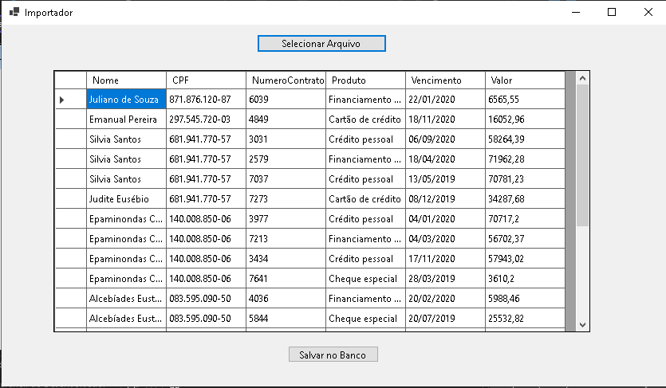
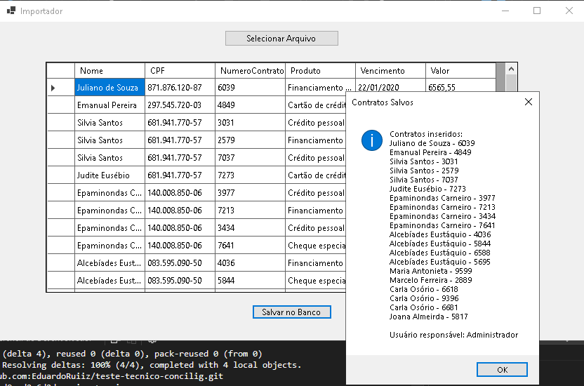
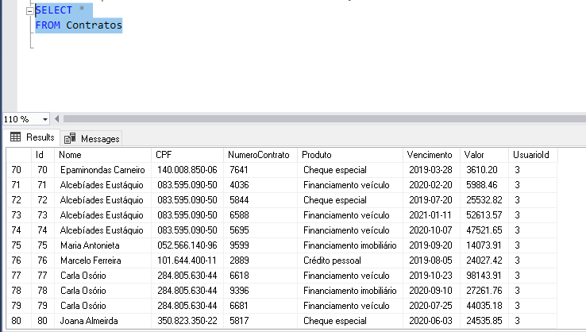

# Teste técnico Concilig

## Descrição do projeto

O projeto a seguir consiste em uma aplicação desktop, que realiza um login administrativo e então a importação de dados CSV para o banco de dados, e exibe na tela os dados inseridos e quem fez a inserção dos dados.

## Funcionalidades

Importação de contratos via CSV, autenticação de usuário, interfáce gráfica(simplificada).

## Técnologias necessárias

- Visual Studio (para rodar a aplicação).
- SQL SERVER (pode usar a versão Express para desenvolvimento).
- SQL Server Management Studio (SSMS) para gerenciar e visualizar o banco.
- C# (versão recomendada: C# 10 ou superior com .NET 6 ou superior)
- .NET Framework (para utilizar Windows Forms).
- Sistema Operacional Windows.

## Como executar

1. Clone este repositório em sua máquina.
2. Abra o arquivo `ImportadorContratos/ImportadorContratos.sln` no Visual Studio.
3. Restaure os pacotes NuGet, caso solicitado pelo Visual Studio.
4. Certifique-se de que o banco de dados está criado e acessível (você pode usar o SQL Server Management Studio para isso, a query completa esta no arquivo Init dentro da pasta database).
6. Pressione F5 ou clique em "Iniciar" no Visual Studio para executar a aplicação.

- Agora você pode acessar a aplicação, realizar o login e importar contratos via CSV.

# Prints do funcionamento

## Aplicação iniciada: tela de login administrativo.

## Após realizar o login, será direcionado para essa aba para selecionar o arquivo csv.

## Selecionado o arquivo csv contido na pasta resources.

## Após selecionado, exibe todos os dados do arquivo csv.

## Depois de selecionar e já exibir os dados do arquivo, clicar no botão Salvar no banco, e então a mensagem seguinte irá aparecer se for concluído com sucesso (todos os dados e quem importou para o banco).

## E por último, verificar se foram salvos os dados no banco através da consulta.

